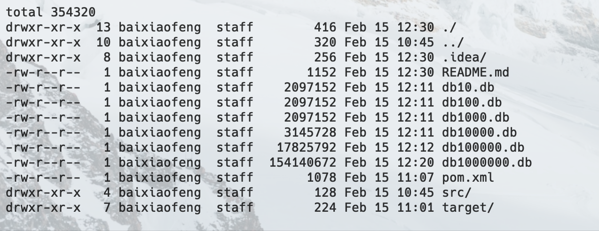
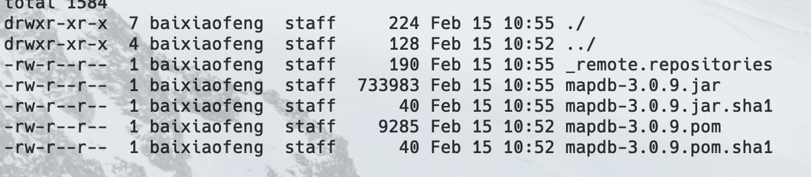
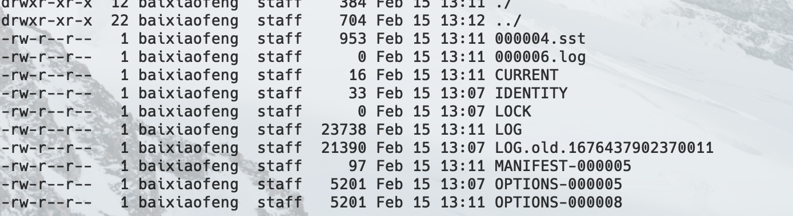
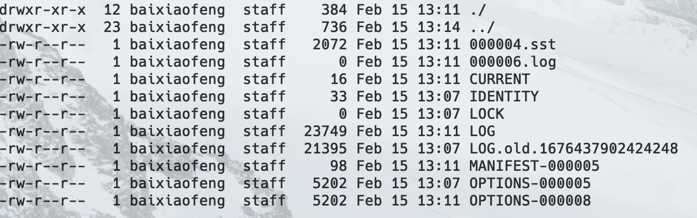
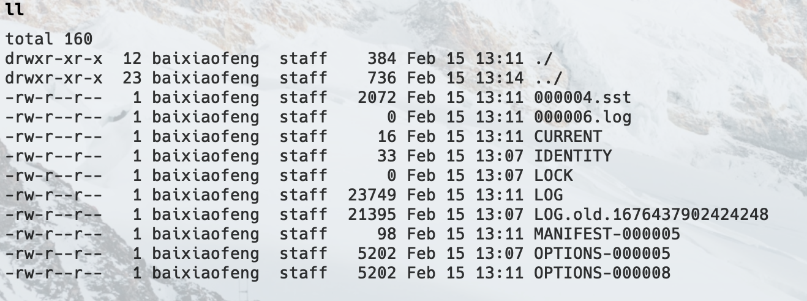
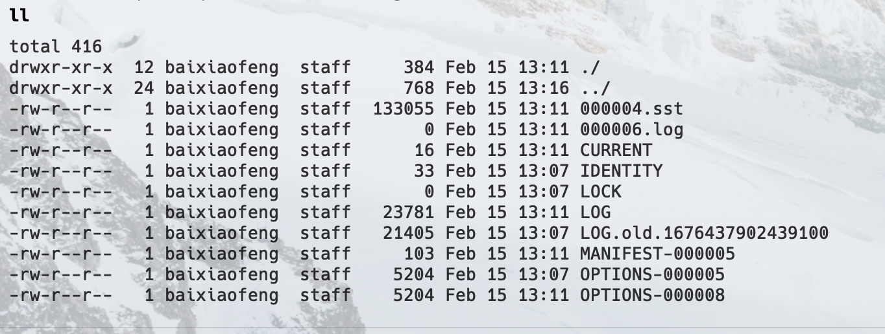
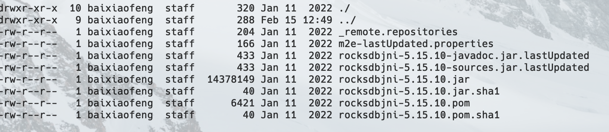

### MapDB
#### time spent in storage
* Databasedb10.db map map10 elapsedNanos = 1078453206 
* Databasedb100.db map map100 elapsedNanos = 275659723
* Databasedb1000.db map map1000 elapsedNanos = 733130504
* Databasedb10000.db map map10000 elapsedNanos = 3934030327
* Databasedb100000.db map map100000 elapsedNanos = 40747136057
* Databasedb1000000.db map map1000000 elapsedNanos = 473628725817

#### time spend in search
* Databasedb10.db map map10 e`lapsedNanos = 767811557
  * Databasedb10.db map map10 instance = Person{name='name1', age=1}
* Databasedb100.db map map100 elapsedNanos = 50518603
  * Databasedb100.db map map100 instance = Person{name='name10', age=10}
* Databasedb1000.db map map1000 elapsedNanos = 49556871
  * Databasedb1000.db map map1000 instance = Person{name='name100', age=100}
* Databasedb10000.db map map10000 elapsedNanos = 50006857
  * Databasedb10000.db map map10000 instance = Person{name='name1000', age=1000}
* Databasedb100000.db map map100000 elapsedNanos = 47894226
  * Databasedb100000.db map map100000 instance = Person{name='name10000', age=10000}
* Databasedb1000000.db map map1000000 elapsedNanos = 55479235
  * Databasedb1000000.db map map1000000 instance = Person{name='name100000', age=100000}

#### size of the db file

#### size of mapdb jar

### RocksDB

#### time spent in storage
* Databasedb10.bin elapsedNanos = 180960162
* Databasedb100.bin elapsedNanos = 3993881
* Databasedb1000.bin elapsedNanos = 25124662
* Databasedb10000.bin elapsedNanos = 329895281
* Databasedb100000.bin elapsedNanos = 1316623998
* Databasedb1000000.bin elapsedNanos = 9212562913

#### time spend in search
* Databasedb10.bin elapsedNanos = 16061516
  * Databasedb10.bin instance = Person{name='name1', age=1}
* Databasedb100.bin elapsedNanos = 246111
  * Databasedb100.bin instance = Person{name='name10', age=10}
* Databasedb1000.bin elapsedNanos = 257274
  * Databasedb1000.bin instance = Person{name='name100', age=100}
* Databasedb10000.bin elapsedNanos = 283932
  * Databasedb10000.bin instance = Person{name='name1000', age=1000}
* Databasedb100000.bin elapsedNanos = 228597
  * Databasedb100000.bin instance = Person{name='name10000', age=10000}
* Databasedb1000000.bin elapsedNanos = 250921
  * Databasedb1000000.bin instance = Person{name='name100000', age=100000}

#### size of the db file
##### db10

##### db100

##### db1000

##### db10000

##### db100000

#### size of rocks jar
